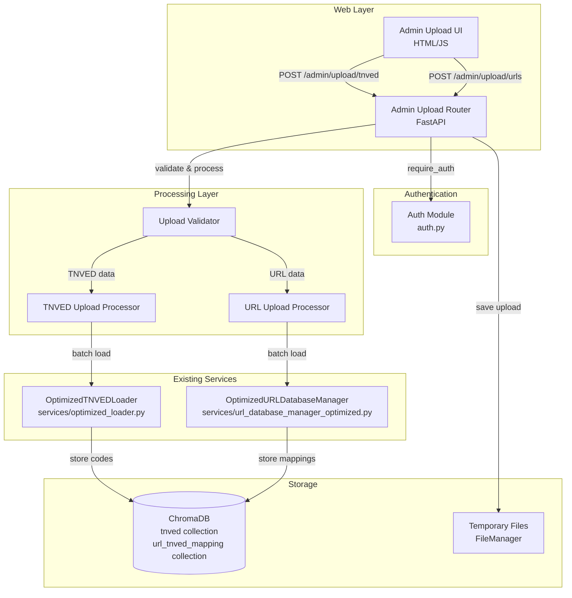

# Design Document: Admin Data Upload Feature

## Overview

The admin data upload feature extends the existing batch processor web application to support uploading TNVED code data and URL mappings through a web interface. This feature replaces manual CLI-based data loading (load_import_26_01.py, load_urls_fast.py) with an authenticated web interface while reusing existing optimized data processing services.

### Key Design Principles

1. **Reuse Existing Services**: Leverage OptimizedURLDatabaseManager and OptimizedTNVEDLoader for data processing
2. **Consistent Architecture**: Follow the existing FastAPI router pattern used in batch_processor/web/
3. **Authentication Integration**: Use existing auth.py authentication mechanism
4. **Async Processing**: Support both synchronous and async processing patterns like existing upload.py
5. **Progress Tracking**: Provide real-time feedback during long-running uploads
6. **Error Resilience**: Continue processing valid records even when some records fail validation

### Technology Stack

- **Web Framework**: FastAPI (existing)
- **Authentication**: HTTP Basic Auth via batch_processor/web/auth.py
- **File Processing**: Pandas for Excel/Parquet reading
- **Database**: ChromaDB via existing managers
- **Frontend**: HTML/JavaScript with progress tracking
- **File Formats**: Excel (.xlsx, .xls), Parquet (.parquet)

## Architecture

### Component Diagram



### Request Flow

1. **Authentication**: User provides credentials via HTTP Basic Auth
2. **File Upload**: User selects file type (TNVED/URL), provides source name, uploads file
3. **Validation**: System validates file format, required columns, and data types
4. **Processing**: System processes data in batches using existing optimized services
5. **Progress Updates**: System provides real-time progress feedback
6. **Results**: System displays summary with success/error counts and statistics

## Components and Interfaces

### 1. Admin Upload Router (admin_upload.py)

New FastAPI router module at `batch_processor/web/admin_upload.py`

```python
from fastapi import APIRouter, UploadFile, File, Form, Depends, HTTPException
from fastapi.responses import JSONResponse, HTMLResponse
from .auth import require_auth
from .models import AdminUploadResponse, AdminUploadSummary

router = APIRouter(prefix="/admin/upload", tags=["admin"])

@router.get("/", response_class=HTMLResponse)
async def admin_upload_page(user: str = Depends(require_auth)):
    """Serve admin upload interface"""
    pass

@router.post("/tnved", response_model=AdminUploadResponse)
async def upload_tnved_data(
    file: UploadFile = File(...),
    source_name: str = Form(...),
    user: str = Depends(require_auth)
):
    """Upload TNVED codes with descriptions"""
    pass

@router.post("/urls", response_model=AdminUploadResponse)
async def upload_url_mappings(
    file: UploadFile = File(...),
    source_name: str = Form(...),
    user: str = Depends(require_auth)
):
    """Upload URL-to-TNVED code mappings"""
    pass

@router.post("/validate", response_model=ValidationResult)
async def validate_admin_file(
    file: UploadFile = File(...),
    upload_type: str = Form(...),  # "tnved" or "urls"
    user: str = Depends(require_auth)
):
    """Validate file without processing"""
    pass
```

### 2. Upload Validator

Validates uploaded files before processing

```python
class AdminUploadValidator:
    """Validates admin upload files"""
    
    TNVED_REQUIRED_COLUMNS = ["Code", "Description"]
    URL_REQUIRED_COLUMNS = ["URL", "Code"]
    URL_OPTIONAL_COLUMNS = ["Description"]
    
    SUPPORTED_FORMATS = [".xlsx", ".xls", ".parquet"]
    MAX_FILE_SIZE_MB = 100
    
    def validate_file_format(self, file: UploadFile) -> Tuple[bool, str]:
        """Validate file extension and size"""
        pass
    
    def validate_tnved_file(self, file_path: Path) -> ValidationResult:
        """Validate TNVED data file structure and content"""
        pass
    
    def validate_url_file(self, file_path: Path) -> ValidationResult:
        """Validate URL mapping file structure and content"""
        pass
    
    def validate_source_name(self, source_name: str) -> Tuple[bool, str]:
        """Validate source name format (alphanumeric, hyphens, underscores)"""
        pass
```

### 3. TNVED Upload Processor

Processes TNVED code uploads using existing OptimizedTNVEDLoader

```python
class TNVEDUploadProcessor:
    """Processes TNVED code uploads"""
    
    def __init__(self, db_path: str, batch_size: int = 5000):
        self.db_path = db_path
        self.batch_size = batch_size
        self.normalizer = TextNormalizer()
        self.embedder = EmbeddingGenerator()
    
    async def process_upload(
        self,
        file_path: Path,
        source_name: str,
        progress_callback: Optional[Callable] = None
    ) -> UploadSummary:
        """
        Process TNVED code upload
        
        Args:
            file_path: Path to uploaded file
            source_name: Data source identifier
            progress_callback: Optional callback for progress updates
            
        Returns:
            UploadSummary with processing statistics
        """
        pass
    
    def _normalize_codes(self, df: pd.DataFrame) -> pd.DataFrame:
        """Normalize TNVED codes to 10-digit format"""
        pass
    
    def _deduplicate_codes(self, df: pd.DataFrame) -> pd.DataFrame:
        """Remove duplicate codes, keeping first occurrence"""
        pass
```

### 4. URL Upload Processor

Processes URL mapping uploads using existing OptimizedURLDatabaseManager

```python
class URLUploadProcessor:
    """Processes URL mapping uploads"""
    
    def __init__(self, chroma_client: chromadb.Client, batch_size: int = 5000):
        self.db_manager = OptimizedURLDatabaseManager(
            chroma_client, 
            "url_tnved_mapping"
        )
        self.batch_size = batch_size
    
    async def process_upload(
        self,
        file_path: Path,
        source_name: str,
        progress_callback: Optional[Callable] = None
    ) -> UploadSummary:
        """
        Process URL mapping upload
        
        Args:
            file_path: Path to uploaded file
            source_name: Data source identifier
            progress_callback: Optional callback for progress updates
            
        Returns:
            UploadSummary with processing statistics
        """
        pass
    
    def _validate_and_normalize_urls(
        self, 
        df: pd.DataFrame
    ) -> Tuple[pd.DataFrame, List[str]]:
        """Validate and normalize URLs, return valid data and errors"""
        pass
    
    def _validate_codes(
        self, 
        df: pd.DataFrame
    ) -> Tuple[pd.DataFrame, List[str]]:
        """Validate TNVED codes, return valid data and errors"""
        pass
    
    def _deduplicate_urls(self, df: pd.DataFrame) -> pd.DataFrame:
        """Remove duplicate URLs, keeping first occurrence"""
        pass
```

### 5. Progress Tracker

Tracks and reports upload progress

```python
class UploadProgressTracker:
    """Tracks upload progress for real-time feedback"""
    
    def __init__(self, total_records: int):
        self.total_records = total_records
        self.processed_records = 0
        self.start_time = time.time()
    
    def update(self, processed: int) -> ProgressUpdate:
        """Update progress and calculate metrics"""
        self.processed_records = processed
        elapsed = time.time() - self.start_time
        
        progress_pct = (processed / self.total_records) * 100
        records_per_sec = processed / elapsed if elapsed > 0 else 0
        remaining = self.total_records - processed
        eta_seconds = remaining / records_per_sec if records_per_sec > 0 else 0
        
        return ProgressUpdate(
            processed=processed,
            total=self.total_records,
            progress_pct=progress_pct,
            records_per_sec=records_per_sec,
            eta_seconds=eta_seconds
        )
```

## Data Models

### Request/Response Models

```python
from pydantic import BaseModel, Field, validator
from typing import Optional, List, Dict
from datetime import datetime

class AdminUploadResponse(BaseModel):
    """Response for admin upload initiation"""
    upload_id: str
    filename: str
    file_size: int
    upload_type: str  # "tnved" or "urls"
    source_name: str
    total_records: int
    message: str

class UploadSummary(BaseModel):
    """Summary of upload processing results"""
    upload_id: str
    upload_type: str
    source_name: str
    total_records: int
    successful_records: int
    failed_records: int
    invalid_urls: Optional[int] = None
    invalid_codes: Optional[int] = None
    processing_time_seconds: float
    records_per_second: float
    database_total_records: int
    errors: List[str] = []

class ProgressUpdate(BaseModel):
    """Progress update during upload processing"""
    processed: int
    total: int
    progress_pct: float
    records_per_sec: float
    eta_seconds: float
    current_batch: Optional[int] = None

class AdminValidationResult(BaseModel):
    """Validation result for admin uploads"""
    is_valid: bool
    upload_type: str
    error_message: Optional[str] = None
    total_records: int
    missing_columns: List[str] = []
    file_info: Dict[str, Any] = {}
    warnings: List[str] = []
```

### Database Schema

Uses existing ChromaDB collections:

**TNVED Collection** (collection name: "tnved")
- id: str (unique identifier)
- code: str (10-digit TNVED code)
- description: str (product description)
- embedding: List[float] (semantic embedding)
- metadata: Dict (source, timestamps, etc.)

**URL Mapping Collection** (collection name: "url_tnved_mapping")
- id: str (unique identifier)
- original_url: str
- normalized_url: str
- tnved_code: str (10-digit code)
- description: str
- source_name: str
- domain: str
- product_id: Optional[str]
- shop_type: Optional[str]
- created_at: str
- updated_at: str

## Correctness Properties

*A property is a characteristic or behavior that should hold true across all valid executions of a system—essentially, a formal statement about what the system should do. Properties serve as the bridge between human-readable specifications and machine-verifiable correctness guarantees.*

### Property 1: File Format Acceptance
*For any* admin upload (TNVED or URL), when a file with extension .xlsx, .xls, or .parquet is submitted, the system should accept the file format and proceed to content validation.
**Validates: Requirements 2.1, 3.1**

### Property 2: Required Column Validation
*For any* TNVED upload file, the file should be rejected if and only if it is missing either the "Code" or "Description" column. *For any* URL upload file, the file should be rejected if and only if it is missing either the "URL" or "Code" column.
**Validates: Requirements 2.2, 3.2**

### Property 3: TNVED Code Normalization
*For any* TNVED code in an uploaded file, after processing, the code should be exactly 10 digits long with leading zeros added as needed.
**Validates: Requirements 2.3**

### Property 4: URL Normalization Consistency
*For any* URL in an uploaded file, the normalized URL should be equivalent to applying the URLNormalizer service to the original URL.
**Validates: Requirements 3.3**

### Property 5: Error Resilience
*For any* upload file containing a mix of valid and invalid records (invalid URLs, invalid codes, or missing data), the system should process all valid records successfully and report the count of invalid records by type.
**Validates: Requirements 2.4, 3.4, 3.5, 6.4, 6.6**

### Property 6: Deduplication by Key
*For any* TNVED upload containing duplicate codes, only the first occurrence of each code should be stored. *For any* URL upload containing duplicate URLs, only the first occurrence of each URL should be stored.
**Validates: Requirements 2.5, 3.6, 12.5**

### Property 7: Upload Summary Completeness
*For any* completed upload, the summary should include: total records processed, successfully loaded count, validation error counts by type, processing time, processing speed (records/sec), and current database total.
**Validates: Requirements 2.6, 3.7, 8.1, 8.2, 8.3, 8.4, 8.5, 8.6**

### Property 8: Source Name Association
*For any* upload with source name S, all successfully stored records from that upload should have their source_name field set to S.
**Validates: Requirements 9.2**

### Property 9: Source Name Validation
*For any* source name string, it should be accepted if and only if it contains only alphanumeric characters, hyphens, and underscores.
**Validates: Requirements 9.3, 9.4**

### Property 10: Concurrent Upload Isolation
*For any* two uploads U1 and U2 processed concurrently, the records stored from U1 should not interfere with or corrupt the records stored from U2, and both uploads should complete with correct summaries.
**Validates: Requirements 10.1, 10.4**

### Property 11: Temporary File Cleanup
*For any* completed upload, all temporary files created during that upload should be removed from the file system.
**Validates: Requirements 10.5**

### Property 12: Additive Data Storage
*For any* database state D1 before an upload and state D2 after the upload, D2 should contain all records from D1 plus the new valid records from the upload (no records from D1 should be removed).
**Validates: Requirements 12.3, 12.4**

### Property 13: Progress Updates During Processing
*For any* upload processing more than one batch, progress updates should be generated showing increasing processed record counts until completion.
**Validates: Requirements 5.2, 5.3**

### Property 14: Missing Column Error Reporting
*For any* file missing required columns, the validation error message should list all missing column names.
**Validates: Requirements 6.1**

### Property 15: Unsupported Format Error Reporting
*For any* file with an unsupported extension, the validation error message should list all supported formats (.xlsx, .xls, .parquet).
**Validates: Requirements 6.3**


## Error Handling

### Error Categories

1. **Authentication Errors**
   - Invalid credentials → 401 Unauthorized
   - Missing credentials → 401 Unauthorized with WWW-Authenticate header
   - Session expired → 401 Unauthorized

2. **Validation Errors**
   - Unsupported file format → 400 Bad Request with supported formats list
   - Missing required columns → 400 Bad Request with missing columns list
   - Invalid source name → 400 Bad Request with format requirements
   - File too large → 413 Payload Too Large with size limit
   - Empty file → 400 Bad Request

3. **Processing Errors**
   - Invalid TNVED codes → Logged, counted, processing continues
   - Invalid URLs → Logged, counted, processing continues
   - Database connection failure → 500 Internal Server Error
   - File read error → 500 Internal Server Error
   - Timeout → 504 Gateway Timeout

4. **Concurrent Access Errors**
   - User already has upload in progress → 409 Conflict

### Error Response Format

```python
{
    "error": "ValidationError",
    "detail": "Missing required columns: Code, Description",
    "timestamp": "2024-01-15T10:30:00Z",
    "upload_id": "uuid-here",
    "missing_columns": ["Code", "Description"]
}
```

### Error Recovery Strategies

1. **Partial Success**: Continue processing valid records even when some fail validation
2. **Cleanup on Failure**: Remove temporary files if upload fails before processing
3. **Transaction Safety**: Use ChromaDB's batch operations to ensure atomic writes
4. **Progress Preservation**: Track progress so users know how much was processed before failure
5. **Detailed Logging**: Log all errors with context for debugging

### Error Logging

```python
# Structured error logging
logger.error(
    "Upload validation failed",
    extra={
        "user": username,
        "upload_id": upload_id,
        "filename": filename,
        "error_type": "missing_columns",
        "missing_columns": ["Code"],
        "upload_type": "tnved"
    }
)
```

## Testing Strategy

### Dual Testing Approach

The testing strategy combines unit tests for specific scenarios and property-based tests for universal properties:

- **Unit Tests**: Verify specific examples, edge cases, and error conditions
- **Property Tests**: Verify universal properties across randomized inputs
- Both approaches are complementary and necessary for comprehensive coverage

### Unit Testing

Unit tests focus on:

1. **Authentication Flow**
   - Test valid credentials grant access
   - Test invalid credentials are rejected
   - Test unauthenticated access is blocked
   - Test session management

2. **File Upload Mechanics**
   - Test file saving to temporary storage
   - Test file cleanup after processing
   - Test file size limit enforcement
   - Test format detection

3. **Validation Edge Cases**
   - Test empty files
   - Test files with no data rows
   - Test files with all invalid data
   - Test files with special characters in source names

4. **UI Integration**
   - Test upload page renders correctly
   - Test form submission
   - Test progress display updates
   - Test error message display

5. **Database Integration**
   - Test connection to ChromaDB
   - Test collection access
   - Test batch write operations
   - Test statistics retrieval

### Property-Based Testing

Property tests verify universal correctness properties using randomized inputs. Each test should run a minimum of 100 iterations.

**Testing Library**: Use `hypothesis` for Python property-based testing

**Test Configuration**:
```python
from hypothesis import given, settings
import hypothesis.strategies as st

@settings(max_examples=100)
@given(
    codes=st.lists(st.text(min_size=1, max_size=15), min_size=1, max_size=1000),
    descriptions=st.lists(st.text(min_size=1), min_size=1, max_size=1000)
)
def test_property_tnved_code_normalization(codes, descriptions):
    """
    Feature: admin-data-upload, Property 3: TNVED Code Normalization
    For any TNVED code, after processing it should be exactly 10 digits
    """
    # Test implementation
    pass
```

**Properties to Test**:

1. **Property 1: File Format Acceptance** (Feature: admin-data-upload, Property 1)
   - Generate files with various extensions
   - Verify .xlsx, .xls, .parquet are accepted
   - Verify other extensions are rejected

2. **Property 2: Required Column Validation** (Feature: admin-data-upload, Property 2)
   - Generate DataFrames with various column combinations
   - Verify files with required columns pass validation
   - Verify files missing required columns fail validation

3. **Property 3: TNVED Code Normalization** (Feature: admin-data-upload, Property 3)
   - Generate codes of various lengths (1-15 digits)
   - Verify all codes become exactly 10 digits after processing
   - Verify leading zeros are added correctly

4. **Property 4: URL Normalization Consistency** (Feature: admin-data-upload, Property 4)
   - Generate various URL formats
   - Verify normalized URLs match URLNormalizer output
   - Test URLs from different shops (ozon, wildberries, etc.)

5. **Property 5: Error Resilience** (Feature: admin-data-upload, Property 5)
   - Generate files with mix of valid/invalid records
   - Verify all valid records are processed
   - Verify error counts are accurate

6. **Property 6: Deduplication by Key** (Feature: admin-data-upload, Property 6)
   - Generate files with duplicate codes/URLs
   - Verify only first occurrence is kept
   - Verify deduplication count is correct

7. **Property 7: Upload Summary Completeness** (Feature: admin-data-upload, Property 7)
   - Generate various upload scenarios
   - Verify summary contains all required fields
   - Verify counts are accurate

8. **Property 8: Source Name Association** (Feature: admin-data-upload, Property 8)
   - Generate uploads with various source names
   - Verify all stored records have correct source_name
   - Query database and check source_name field

9. **Property 9: Source Name Validation** (Feature: admin-data-upload, Property 9)
   - Generate source names with various characters
   - Verify alphanumeric + hyphen + underscore are accepted
   - Verify other characters are rejected

10. **Property 10: Concurrent Upload Isolation** (Feature: admin-data-upload, Property 10)
    - Simulate concurrent uploads
    - Verify no data corruption
    - Verify both uploads complete successfully

11. **Property 11: Temporary File Cleanup** (Feature: admin-data-upload, Property 11)
    - Track temporary files created during upload
    - Verify all are removed after completion
    - Check file system state

12. **Property 12: Additive Data Storage** (Feature: admin-data-upload, Property 12)
    - Record database state before upload
    - Perform upload
    - Verify old records still exist plus new records

13. **Property 13: Progress Updates During Processing** (Feature: admin-data-upload, Property 13)
    - Process multi-batch uploads
    - Verify progress updates are generated
    - Verify processed count increases monotonically

14. **Property 14: Missing Column Error Reporting** (Feature: admin-data-upload, Property 14)
    - Generate files missing various columns
    - Verify error message lists all missing columns
    - Verify error message format

15. **Property 15: Unsupported Format Error Reporting** (Feature: admin-data-upload, Property 15)
    - Submit files with unsupported extensions
    - Verify error message lists supported formats
    - Verify error message format

### Integration Testing

Integration tests verify end-to-end workflows:

1. **Complete TNVED Upload Flow**
   - Authenticate → Upload file → Validate → Process → Verify database → Check summary

2. **Complete URL Upload Flow**
   - Authenticate → Upload file → Validate → Process → Verify database → Check summary

3. **Error Recovery Flow**
   - Upload invalid file → Verify error → Verify cleanup → Retry with valid file

4. **Concurrent Upload Flow**
   - Start two uploads simultaneously → Verify both complete → Verify data integrity

### Performance Testing

Performance tests verify system meets performance requirements:

1. **Large File Processing**
   - Test 100 MB file upload
   - Verify processing completes within timeout
   - Verify progress updates are responsive

2. **Batch Processing Speed**
   - Measure records per second
   - Target: 500-2000 records/sec (matching CLI loaders)
   - Verify GPU acceleration is used when available

3. **Concurrent Load**
   - Test multiple simultaneous uploads
   - Verify system remains responsive
   - Verify no performance degradation

### Test Data Generation

Use realistic test data:

```python
# TNVED test data
def generate_tnved_test_data(num_records: int) -> pd.DataFrame:
    """Generate realistic TNVED test data"""
    codes = [f"{random.randint(0, 9999999999):010d}" for _ in range(num_records)]
    descriptions = [f"Product description {i}" for i in range(num_records)]
    return pd.DataFrame({"Code": codes, "Description": descriptions})

# URL test data
def generate_url_test_data(num_records: int) -> pd.DataFrame:
    """Generate realistic URL test data"""
    shops = ["ozon.ru", "wildberries.ru", "market.yandex.ru"]
    urls = [
        f"https://{random.choice(shops)}/product/{random.randint(1000, 999999)}/"
        for _ in range(num_records)
    ]
    codes = [f"{random.randint(0, 9999999999):010d}" for _ in range(num_records)]
    descriptions = [f"Product {i}" for i in range(num_records)]
    return pd.DataFrame({
        "URL": urls,
        "Code": codes,
        "Description": descriptions
    })
```

## Implementation Notes

### File Processing Optimization

1. **Parquet Preference**: Recommend Parquet for large files (5-10x faster reading than Excel)
2. **Streaming Processing**: Process files in batches to handle large files without loading entirely into memory
3. **GPU Acceleration**: Use existing EmbeddingGenerator with GPU support for TNVED embeddings
4. **Batch Size**: Default 5000 records per batch (configurable via config.yaml)

### Security Considerations

1. **Authentication**: Reuse existing HTTP Basic Auth from auth.py
2. **File Validation**: Validate file format and size before processing
3. **Input Sanitization**: Validate source names to prevent injection attacks
4. **Session Isolation**: Use session IDs to isolate user uploads
5. **Temporary File Security**: Store uploads in user-specific temporary directories

### Configuration

Add to existing config.yaml:

```yaml
admin_upload:
  enabled: true
  max_file_size_mb: 100
  batch_size: 5000
  temp_dir: "./temp_uploads"
  cleanup_interval_hours: 1
  max_concurrent_uploads_per_user: 1
  supported_formats: [".xlsx", ".xls", ".parquet"]
  recommend_parquet_threshold_mb: 10
  large_file_threshold_mb: 50
  upload_timeout_minutes: 30
```

### Frontend Implementation

Use existing patterns from batch_processor/templates/:

```html
<!-- Admin upload page -->
<div class="upload-section">
    <h2>TNVED Code Upload</h2>
    <form id="tnved-upload-form" enctype="multipart/form-data">
        <input type="text" name="source_name" placeholder="Source name" required>
        <input type="file" name="file" accept=".xlsx,.xls,.parquet" required>
        <button type="submit">Upload TNVED Data</button>
    </form>
    <div id="tnved-progress" style="display:none;">
        <div class="progress-bar"></div>
        <div class="progress-text"></div>
    </div>
</div>

<div class="upload-section">
    <h2>URL Mapping Upload</h2>
    <form id="url-upload-form" enctype="multipart/form-data">
        <input type="text" name="source_name" placeholder="Source name" required>
        <input type="file" name="file" accept=".xlsx,.xls,.parquet" required>
        <button type="submit">Upload URL Mappings</button>
    </form>
    <div id="url-progress" style="display:none;">
        <div class="progress-bar"></div>
        <div class="progress-text"></div>
    </div>
</div>
```

JavaScript for progress tracking:

```javascript
async function uploadFile(formId, uploadType) {
    const form = document.getElementById(formId);
    const formData = new FormData(form);
    
    // Show progress
    const progressDiv = document.getElementById(`${uploadType}-progress`);
    progressDiv.style.display = 'block';
    
    try {
        const response = await fetch(`/admin/upload/${uploadType}`, {
            method: 'POST',
            body: formData,
            credentials: 'include'
        });
        
        const result = await response.json();
        
        if (response.ok) {
            // Poll for progress updates
            pollProgress(result.upload_id, uploadType);
        } else {
            showError(result.detail);
        }
    } catch (error) {
        showError(error.message);
    }
}

async function pollProgress(uploadId, uploadType) {
    const interval = setInterval(async () => {
        const response = await fetch(`/admin/upload/progress/${uploadId}`);
        const progress = await response.json();
        
        updateProgressBar(uploadType, progress);
        
        if (progress.status === 'completed' || progress.status === 'failed') {
            clearInterval(interval);
            showSummary(progress);
        }
    }, 1000);
}
```

### Database Schema Considerations

No schema changes required - uses existing ChromaDB collections:

- **tnved collection**: Stores TNVED codes with embeddings
- **url_tnved_mapping collection**: Stores URL-to-code mappings

Both collections support metadata fields for source tracking.

### Monitoring and Logging

Add structured logging for admin uploads:

```python
structured_logger.log_admin_upload(
    user=username,
    upload_type="tnved",
    source_name=source_name,
    filename=filename,
    file_size=file_size,
    total_records=total_records,
    successful_records=successful_records,
    failed_records=failed_records,
    processing_time=elapsed_time,
    success=True
)
```

### Deployment Considerations

1. **No Breaking Changes**: Feature is additive, doesn't modify existing functionality
2. **Backward Compatibility**: CLI loaders continue to work unchanged
3. **Configuration**: Add admin_upload section to config.yaml
4. **Dependencies**: No new dependencies required (uses existing libraries)
5. **Database Migration**: None required (uses existing collections)

## Future Enhancements

Potential future improvements (not in current scope):

1. **Async Processing**: Use Celery for background processing of large uploads
2. **WebSocket Progress**: Real-time progress updates via WebSocket
3. **Upload History**: Track and display previous uploads per user
4. **Data Preview**: Show sample of data before processing
5. **Rollback**: Ability to undo an upload
6. **Bulk Operations**: Upload multiple files at once
7. **Scheduled Uploads**: Cron-like scheduling for recurring uploads
8. **Data Validation Rules**: Configurable validation rules per source
9. **Export Functionality**: Download current database contents
10. **Audit Log**: Detailed audit trail of all admin operations
