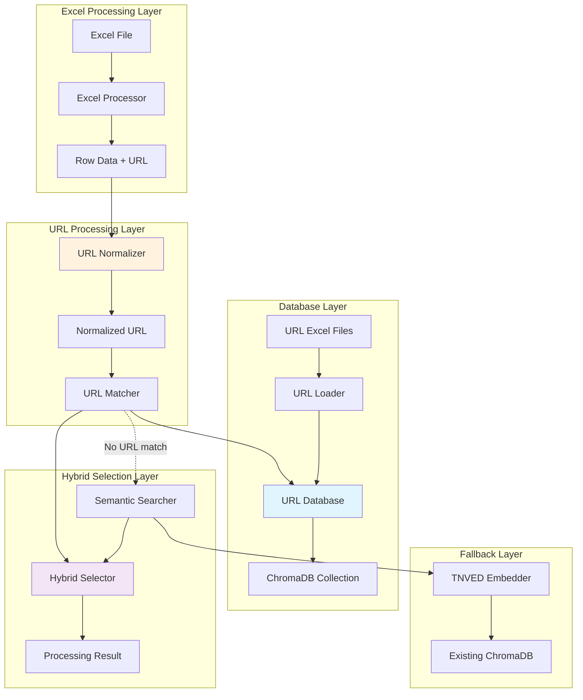

# Design Document: URL-Based Code Matching

## Overview

Система URL-based поиска кодов ТНВЭД расширяет существующий алгоритм пакетной обработки Excel файлов, добавляя возможность поиска кодов по URL-адресам товаров из интернет-магазинов. Система использует двухэтапный подход: сначала точный поиск по нормализованным URL, затем семантический поиск как резервный метод.

Архитектура основана на принципе гибридного селектора, который интегрируется с существующими компонентами системы, сохраняя обратную совместимость и добавляя новую функциональность без нарушения текущих процессов.

## Architecture

### High-Level Architecture



### Component Integration Flow

1. **URL Extraction**: Excel Processor извлекает URL из колонки "Link to customer's web-page with item description"
2. **URL Normalization**: URL Normalizer стандартизирует URL (удаляет параметры, нормализует протокол)
3. **URL Matching**: URL Matcher ищет точное соответствие в URL Database
4. **Hybrid Selection**: Hybrid Selector координирует URL-поиск и семантический поиск
5. **Fallback Processing**: При отсутствии URL-соответствия используется существующий семантический поиск
6. **Result Generation**: Формируется результат с указанием источника найденного кода

## Components and Interfaces

### 1. URL Normalizer

**Responsibility**: Нормализация URL для обеспечения консистентного поиска

**Interface**:
```python
from urllib.parse import urlparse, urlunparse
import re
from typing import Optional, Dict, Any
from dataclasses import dataclass

@dataclass
class NormalizedURL:
    original_url: str
    normalized_url: str
    domain: str
    product_id: Optional[str] = None
    shop_type: Optional[str] = None  # 'ozon', 'yandex_market', 'wildberries', etc.

class URLNormalizer:
    def __init__(self):
        self.shop_patterns = {
            'ozon': {
                'domain_pattern': r'ozon\.ru',
                'product_pattern': r'/product/(\d+)/?',
                'normalize_path': '/product/{product_id}/'
            },
            'yandex_market': {
                'domain_pattern': r'market\.yandex\.ru',
                'product_pattern': r'/product/(\d+)',
                'normalize_path': '/product/{product_id}'
            },
            'wildberries': {
                'domain_pattern': r'wildberries\.ru',
                'product_pattern': r'/catalog/(\d+)/',
                'normalize_path': '/catalog/{product_id}/'
            },
            'aliexpress': {
                'domain_pattern': r'aliexpress\.(ru|com)',
                'product_pattern': r'/item/(\d+)\.html',
                'normalize_path': '/item/{product_id}.html'
            }
        }
    
    def normalize_url(self, url: str) -> Optional[NormalizedURL]:
        """
        Нормализует URL для поиска в базе данных
        
        Args:
            url: Исходный URL товара
            
        Returns:
            NormalizedURL объект или None если URL невалидный
        """
        if not url or not isinstance(url, str):
            return None
            
        try:
            # Базовая нормализация
            parsed = urlparse(url.strip())
            
            # Стандартизация протокола
            if not parsed.scheme:
                url = 'https://' + url
                parsed = urlparse(url)
            elif parsed.scheme == 'http':
                parsed = parsed._replace(scheme='https')
            
            # Удаление query параметров и фрагментов
            clean_parsed = parsed._replace(query='', fragment='')
            
            # Определение типа магазина и извлечение product_id
            shop_type, product_id = self._identify_shop_and_extract_id(parsed.netloc, parsed.path)
            
            # Специальная нормализация для известных магазинов
            if shop_type and product_id:
                pattern_info = self.shop_patterns[shop_type]
                normalized_path = pattern_info['normalize_path'].format(product_id=product_id)
                clean_parsed = clean_parsed._replace(path=normalized_path)
            
            normalized_url = urlunparse(clean_parsed)
            
            return NormalizedURL(
                original_url=url,
                normalized_url=normalized_url,
                domain=parsed.netloc,
                product_id=product_id,
                shop_type=shop_type
            )
            
        except Exception as e:
            # Логирование ошибки
            return None
    
    def _identify_shop_and_extract_id(self, domain: str, path: str) -> tuple[Optional[str], Optional[str]]:
        """Определяет тип магазина и извлекает ID товара"""
        for shop_type, pattern_info in self.shop_patterns.items():
            if re.search(pattern_info['domain_pattern'], domain, re.IGNORECASE):
                match = re.search(pattern_info['product_pattern'], path)
                if match:
                    return shop_type, match.group(1)
        return None, None
    
    def validate_url(self, url: str) -> bool:
        """Проверяет валидность URL"""
        normalized = self.normalize_url(url)
        return normalized is not None
```

### 2. URL Database Manager

**Responsibility**: Управление базой данных URL-соответствий

**Interface**:
```python
from typing import List, Optional, Dict, Any
import chromadb
from chromadb.config import Settings

@dataclass
class URLRecord:
    id: str
    original_url: str
    normalized_url: str
    tnved_code: str
    description: str
    source_name: str
    domain: str
    product_id: Optional[str] = None
    shop_type: Optional[str] = None
    created_at: Optional[str] = None
    updated_at: Optional[str] = None

class URLDatabaseManager:
    def __init__(self, chroma_client: chromadb.Client, collection_name: str = "url_tnved_mapping"):
        self.client = chroma_client
        self.collection_name = collection_name
        self.collection = self._get_or_create_collection()
        self.normalizer = URLNormalizer()
    
    def _get_or_create_collection(self):
        """Создает или получает коллекцию для URL-записей"""
        try:
            return self.client.get_collection(name=self.collection_name)
        except:
            return self.client.create_collection(
                name=self.collection_name,
                metadata={"description": "URL to TNVED code mappings"}
            )
    
    def add_url_record(self, url: str, tnved_code: str, description: str, source_name: str) -> bool:
        """
        Добавляет запись URL-код в базу данных
        
        Args:
            url: URL товара
            tnved_code: Код ТНВЭД
            description: Описание товара
            source_name: Источник данных
            
        Returns:
            True если запись добавлена успешно
        """
        normalized = self.normalizer.normalize_url(url)
        if not normalized:
            return False
        
        record_id = self._generate_record_id(normalized.normalized_url)
        
        try:
            self.collection.upsert(
                ids=[record_id],
                documents=[description],
                metadatas=[{
                    "original_url": normalized.original_url,
                    "normalized_url": normalized.normalized_url,
                    "tnved_code": tnved_code,
                    "source_type": "url",
                    "source_name": source_name,
                    "domain": normalized.domain,
                    "product_id": normalized.product_id or "",
                    "shop_type": normalized.shop_type or "",
                    "created_at": self._get_timestamp()
                }]
            )
            return True
        except Exception as e:
            # Логирование ошибки
            return False
    
    def find_by_url(self, url: str) -> Optional[URLRecord]:
        """
        Ищет запись по URL
        
        Args:
            url: URL для поиска
            
        Returns:
            URLRecord если найдена, иначе None
        """
        normalized = self.normalizer.normalize_url(url)
        if not normalized:
            return None
        
        record_id = self._generate_record_id(normalized.normalized_url)
        
        try:
            results = self.collection.get(
                ids=[record_id],
                include=["documents", "metadatas"]
            )
            
            if results['ids']:
                metadata = results['metadatas'][0]
                document = results['documents'][0]
                
                return URLRecord(
                    id=record_id,
                    original_url=metadata['original_url'],
                    normalized_url=metadata['normalized_url'],
                    tnved_code=metadata['tnved_code'],
                    description=document,
                    source_name=metadata['source_name'],
                    domain=metadata['domain'],
                    product_id=metadata.get('product_id'),
                    shop_type=metadata.get('shop_type'),
                    created_at=metadata.get('created_at')
                )
        except Exception as e:
            # Логирование ошибки
            pass
        
        return None
    
    def batch_load_from_excel(self, file_path: str, source_name: str) -> Dict[str, int]:
        """
        Загружает URL-записи из Excel файла
        
        Args:
            file_path: Путь к Excel файлу
            source_name: Имя источника данных
            
        Returns:
            Статистика загрузки
        """
        import pandas as pd
        
        stats = {"total": 0, "success": 0, "errors": 0, "skipped": 0}
        
        try:
            df = pd.read_excel(file_path)
            
            # Проверка наличия необходимых колонок
            required_columns = ['URL', 'Code', 'Description']
            missing_columns = [col for col in required_columns if col not in df.columns]
            if missing_columns:
                raise ValueError(f"Missing columns: {missing_columns}")
            
            for _, row in df.iterrows():
                stats["total"] += 1
                
                url = str(row['URL']).strip() if pd.notna(row['URL']) else ""
                code = str(row['Code']).strip() if pd.notna(row['Code']) else ""
                description = str(row['Description']).strip() if pd.notna(row['Description']) else ""
                
                if not url or not code or not description:
                    stats["skipped"] += 1
                    continue
                
                if self.add_url_record(url, code, description, source_name):
                    stats["success"] += 1
                else:
                    stats["errors"] += 1
            
        except Exception as e:
            # Логирование ошибки
            pass
        
        return stats
    
    def get_statistics(self) -> Dict[str, Any]:
        """Возвращает статистику URL базы данных"""
        try:
            # Получение общего количества записей
            total_count = self.collection.count()
            
            # Получение статистики по источникам
            all_records = self.collection.get(include=["metadatas"])
            
            source_stats = {}
            domain_stats = {}
            shop_stats = {}
            
            for metadata in all_records['metadatas']:
                source = metadata.get('source_name', 'unknown')
                domain = metadata.get('domain', 'unknown')
                shop = metadata.get('shop_type', 'unknown')
                
                source_stats[source] = source_stats.get(source, 0) + 1
                domain_stats[domain] = domain_stats.get(domain, 0) + 1
                shop_stats[shop] = shop_stats.get(shop, 0) + 1
            
            return {
                "total_records": total_count,
                "by_source": source_stats,
                "by_domain": domain_stats,
                "by_shop_type": shop_stats
            }
        except Exception as e:
            return {"error": str(e)}
    
    def _generate_record_id(self, normalized_url: str) -> str:
        """Генерирует уникальный ID для записи на основе нормализованного URL"""
        import hashlib
        return f"url_{hashlib.md5(normalized_url.encode()).hexdigest()}"
    
    def _get_timestamp(self) -> str:
        """Возвращает текущий timestamp"""
        from datetime import datetime
        return datetime.now().isoformat()
```

### 3. URL Matcher

**Responsibility**: Поиск кодов ТНВЭД по URL

**Interface**:
```python
from typing import Optional
from dataclasses import dataclass

@dataclass
class URLMatchResult:
    found: bool
    tnved_code: Optional[str] = None
    description: Optional[str] = None
    source_name: Optional[str] = None
    original_url: Optional[str] = None
    normalized_url: Optional[str] = None
    confidence: float = 1.0  # URL matches имеют максимальную уверенность
    match_type: str = "exact_url"

class URLMatcher:
    def __init__(self, url_db_manager: URLDatabaseManager):
        self.url_db = url_db_manager
        self.normalizer = url_db_manager.normalizer
    
    def find_code_by_url(self, url: str) -> URLMatchResult:
        """
        Ищет код ТНВЭД по URL
        
        Args:
            url: URL товара для поиска
            
        Returns:
            URLMatchResult с результатом поиска
        """
        if not url or not isinstance(url, str):
            return URLMatchResult(found=False)
        
        # Нормализация URL
        normalized = self.normalizer.normalize_url(url)
        if not normalized:
            return URLMatchResult(found=False)
        
        # Поиск в базе данных
        record = self.url_db.find_by_url(url)
        
        if record:
            return URLMatchResult(
                found=True,
                tnved_code=record.tnved_code,
                description=record.description,
                source_name=record.source_name,
                original_url=record.original_url,
                normalized_url=record.normalized_url,
                confidence=1.0,
                match_type="exact_url"
            )
        
        return URLMatchResult(found=False)
    
    def validate_and_suggest_normalization(self, url: str) -> Dict[str, Any]:
        """
        Валидирует URL и предлагает нормализацию
        
        Returns:
            Информация о валидации и нормализации
        """
        result = {
            "original_url": url,
            "is_valid": False,
            "normalized_url": None,
            "shop_type": None,
            "product_id": None,
            "suggestions": []
        }
        
        normalized = self.normalizer.normalize_url(url)
        if normalized:
            result.update({
                "is_valid": True,
                "normalized_url": normalized.normalized_url,
                "shop_type": normalized.shop_type,
                "product_id": normalized.product_id
            })
            
            if normalized.original_url != normalized.normalized_url:
                result["suggestions"].append(
                    f"URL was normalized from {normalized.original_url} to {normalized.normalized_url}"
                )
        else:
            result["suggestions"].append("URL format is invalid or not supported")
        
        return result
```

### 4. Hybrid Selector

**Responsibility**: Координация URL-поиска и семантического поиска

**Interface**:
```python
from abc import ABC, abstractmethod
from typing import Optional, Dict, Any
from enum import Enum

class URLPriority(Enum):
    FIRST = "first"      # URL поиск сначала, затем семантический
    ONLY = "only"        # Только URL поиск
    DISABLED = "disabled" # Только семантический поиск

@dataclass
class HybridProcessingResult:
    row_index: int
    original_description: str
    original_url: Optional[str]
    tnved_code: Optional[str]
    selection_reason: str
    match_source: str  # "url", "semantic", "none"
    confidence_score: Optional[float] = None
    processing_time_ms: Optional[float] = None
    url_normalized: Optional[str] = None

class HybridSelector:
    def __init__(
        self,
        url_matcher: URLMatcher,
        semantic_selector,  # Существующий TNVEDSelector (SimilarityTop1Selector или LLMReasoningSelector)
        url_priority: URLPriority = URLPriority.FIRST,
        url_timeout_seconds: float = 5.0
    ):
        self.url_matcher = url_matcher
        self.semantic_selector = semantic_selector
        self.url_priority = url_priority
        self.url_timeout_seconds = url_timeout_seconds
    
    def select_code(self, description: str, url: Optional[str] = None, row_index: int = 0) -> HybridProcessingResult:
        """
        Выбирает код ТНВЭД используя гибридный подход
        
        Args:
            description: Описание товара
            url: URL товара (опционально)
            row_index: Индекс строки для отслеживания
            
        Returns:
            HybridProcessingResult с результатом обработки
        """
        import time
        start_time = time.time()
        
        # Проверка приоритета URL
        if self.url_priority == URLPriority.DISABLED or not url:
            return self._use_semantic_only(description, url, row_index, start_time)
        
        # Попытка URL поиска
        url_result = self._try_url_search(url)
        
        if url_result.found:
            processing_time = (time.time() - start_time) * 1000
            return HybridProcessingResult(
                row_index=row_index,
                original_description=description,
                original_url=url,
                tnved_code=url_result.tnved_code,
                selection_reason=self._format_url_reason(url_result),
                match_source="url",
                confidence_score=url_result.confidence,
                processing_time_ms=processing_time,
                url_normalized=url_result.normalized_url
            )
        
        # URL не найден - проверяем приоритет
        if self.url_priority == URLPriority.ONLY:
            processing_time = (time.time() - start_time) * 1000
            return HybridProcessingResult(
                row_index=row_index,
                original_description=description,
                original_url=url,
                tnved_code=None,
                selection_reason="URL-only mode: No matching URL found in database",
                match_source="none",
                processing_time_ms=processing_time,
                url_normalized=url_result.normalized_url if hasattr(url_result, 'normalized_url') else None
            )
        
        # Fallback к семантическому поиску
        return self._use_semantic_fallback(description, url, row_index, start_time)
    
    def _try_url_search(self, url: str) -> URLMatchResult:
        """Пытается найти код по URL с таймаутом"""
        import signal
        
        def timeout_handler(signum, frame):
            raise TimeoutError("URL search timeout")
        
        try:
            # Установка таймаута
            signal.signal(signal.SIGALRM, timeout_handler)
            signal.alarm(int(self.url_timeout_seconds))
            
            result = self.url_matcher.find_code_by_url(url)
            
            # Отмена таймаута
            signal.alarm(0)
            
            return result
            
        except TimeoutError:
            signal.alarm(0)
            return URLMatchResult(found=False)
        except Exception as e:
            signal.alarm(0)
            return URLMatchResult(found=False)
    
    def _use_semantic_only(self, description: str, url: Optional[str], row_index: int, start_time: float) -> HybridProcessingResult:
        """Использует только семантический поиск"""
        semantic_result = self.semantic_selector.select_code(description)
        processing_time = (time.time() - start_time) * 1000
        
        reason = "Used semantic search (no valid URL provided)" if not url else "Used semantic search (URL search disabled)"
        if hasattr(semantic_result, 'selection_reason'):
            reason = f"{reason} | {semantic_result.selection_reason}"
        
        return HybridProcessingResult(
            row_index=row_index,
            original_description=description,
            original_url=url,
            tnved_code=getattr(semantic_result, 'tnved_code', None),
            selection_reason=reason,
            match_source="semantic",
            confidence_score=getattr(semantic_result, 'confidence_score', None),
            processing_time_ms=processing_time
        )
    
    def _use_semantic_fallback(self, description: str, url: Optional[str], row_index: int, start_time: float) -> HybridProcessingResult:
        """Использует семантический поиск как fallback после неудачного URL поиска"""
        semantic_result = self.semantic_selector.select_code(description)
        processing_time = (time.time() - start_time) * 1000
        
        reason = "URL not found, used semantic search"
        if hasattr(semantic_result, 'selection_reason'):
            reason = f"{reason} | {semantic_result.selection_reason}"
        
        return HybridProcessingResult(
            row_index=row_index,
            original_description=description,
            original_url=url,
            tnved_code=getattr(semantic_result, 'tnved_code', None),
            selection_reason=reason,
            match_source="semantic",
            confidence_score=getattr(semantic_result, 'confidence_score', None),
            processing_time_ms=processing_time
        )
    
    def _format_url_reason(self, url_result: URLMatchResult) -> str:
        """Форматирует объяснение для URL-найденного кода"""
        return (
            f"Found by URL: {url_result.original_url} | "
            f"Code: {url_result.tnved_code} | "
            f"Description: {url_result.description} | "
            f"Source: {url_result.source_name}"
        )
```

### 5. Enhanced Excel Processor

**Responsibility**: Расширение существующего Excel Processor для работы с URL

**Interface**:
```python
import pandas as pd
from typing import Iterator, Tuple, Optional, List

class EnhancedExcelProcessor:
    def __init__(self, chunk_size: int = 1000):
        self.chunk_size = chunk_size
        self.url_column_names = [
            "Link to customer's web-page with item description",
            "URL",
            "Product URL",
            "Link"
        ]
    
    def validate_file_with_url_support(self, file_path: str) -> Tuple[bool, str, int, bool]:
        """
        Валидирует Excel файл с проверкой URL колонки
        
        Returns:
            (is_valid, error_message, total_rows, has_url_column)
        """
        try:
            df = pd.read_excel(file_path, nrows=1)  # Читаем только заголовки
            
            # Проверка обязательной колонки описания
            if "Product Detailed Description" not in df.columns:
                return False, "Missing required column: Product Detailed Description", 0, False
            
            # Проверка URL колонки
            url_column = self._find_url_column(df.columns)
            has_url_column = url_column is not None
            
            # Подсчет общего количества строк
            full_df = pd.read_excel(file_path)
            total_rows = len(full_df)
            
            return True, "", total_rows, has_url_column
            
        except Exception as e:
            return False, f"Error reading file: {str(e)}", 0, False
    
    def read_file_chunked_with_urls(
        self, 
        file_path: str, 
        process_mode: str = "all"
    ) -> Iterator[Tuple[pd.DataFrame, int, int, Optional[str]]]:
        """
        Читает файл по частям с поддержкой URL
        
        Yields:
            (chunk_dataframe, chunk_start_row, total_rows, url_column_name)
        """
        try:
            # Определение URL колонки
            sample_df = pd.read_excel(file_path, nrows=1)
            url_column = self._find_url_column(sample_df.columns)
            
            # Чтение файла по частям
            total_rows = len(pd.read_excel(file_path))
            
            for chunk_start in range(0, total_rows, self.chunk_size):
                chunk = pd.read_excel(
                    file_path,
                    skiprows=range(1, chunk_start + 1) if chunk_start > 0 else None,
                    nrows=self.chunk_size
                )
                
                # Фильтрация строк согласно режиму обработки
                if process_mode == "empty_only":
                    chunk = self._filter_empty_hts_codes(chunk)
                
                yield chunk, chunk_start, total_rows, url_column
                
        except Exception as e:
            # Логирование ошибки
            return
    
    def _find_url_column(self, columns: List[str]) -> Optional[str]:
        """Находит колонку с URL среди возможных названий"""
        for col_name in columns:
            if col_name in self.url_column_names:
                return col_name
        return None
    
    def _filter_empty_hts_codes(self, df: pd.DataFrame) -> pd.DataFrame:
        """Фильтрует строки с пустыми HTS кодами"""
        if "HTS Code" in df.columns:
            return df[df["HTS Code"].isna() | (df["HTS Code"] == "")]
        return df
    
    def extract_url_from_row(self, row: pd.Series, url_column: Optional[str]) -> Optional[str]:
        """Извлекает URL из строки данных"""
        if not url_column or url_column not in row.index:
            return None
        
        url_value = row[url_column]
        if pd.isna(url_value):
            return None
        
        url_str = str(url_value).strip()
        return url_str if url_str else None
```

## Data Models

### Enhanced Processing Result

```python
@dataclass
class EnhancedProcessingResult:
    row_index: int
    original_description: str
    original_url: Optional[str]
    normalized_url: Optional[str]
    tnved_code: Optional[str]
    selection_reason: str
    match_source: str  # "url", "semantic", "none"
    confidence_score: Optional[float] = None
    processing_time_ms: Optional[float] = None
    url_validation_info: Optional[Dict[str, Any]] = None
    shop_type: Optional[str] = None
    product_id: Optional[str] = None
```

### URL Configuration

```python
@dataclass
class URLConfiguration:
    enabled: bool = True
    priority: URLPriority = URLPriority.FIRST
    timeout_seconds: float = 5.0
    normalize_urls: bool = True
    supported_shops: List[str] = None
    
    def __post_init__(self):
        if self.supported_shops is None:
            self.supported_shops = ['ozon', 'yandex_market', 'wildberries', 'aliexpress']
```

### URL Processing Statistics

```python
@dataclass
class URLProcessingStats:
    total_rows: int
    rows_with_urls: int
    url_matches_found: int
    semantic_fallbacks: int
    url_validation_errors: int
    processing_time_total_ms: float
    average_url_lookup_time_ms: float
    url_match_rate: float
    
    def calculate_rates(self):
        """Вычисляет процентные показатели"""
        if self.total_rows > 0:
            self.url_match_rate = (self.url_matches_found / self.rows_with_urls) if self.rows_with_urls > 0 else 0.0
```

## Correctness Properties

*A property is a characteristic or behavior that should hold true across all valid executions of a system-essentially, a formal statement about what the system should do. Properties serve as the bridge between human-readable specifications and machine-verifiable correctness guarantees.*

### Property 1: Excel File URL Column Detection

*For any* Excel file, the system should correctly identify the presence or absence of URL columns and extract URL values from detected columns for each row.
**Validates: Requirements 1.1, 1.2**

### Property 2: Hybrid Selection Strategy

*For any* row with both description and URL, the system should use both pieces of information for code selection, while rows with only description should fall back to semantic search, and files without URL columns should process using semantic search only.
**Validates: Requirements 1.3, 1.4, 1.5**

### Property 3: URL Normalization Consistency

*For any* URL input, the system should consistently normalize URLs by removing query parameters and fragments, standardizing protocols to HTTPS, preserving domain and product path structure, and applying shop-specific pattern matching for known retailers (Ozon, Yandex Market, Wildberries).
**Validates: Requirements 11.1, 11.2, 11.3, 11.4, 11.5, 12.1, 12.2, 12.3, 12.4, 12.5**

### Property 4: URL Database Operations

*For any* URL data loading operation, the system should normalize URLs before storage, use normalized URLs as primary identifiers while preserving originals, mark records with appropriate source_type metadata, validate URL and TNVED code formats, and handle duplicate normalized URLs by updating existing records.
**Validates: Requirements 2.1, 2.2, 2.3, 2.4, 2.5, 2.6**

### Property 5: Search Priority and Fallback Behavior

*For any* processing request, the system should first attempt URL database lookup for rows with URLs, return associated TNVED codes for URL matches, fall back to semantic search when URL matches are not found, and handle complete search failures with appropriate empty results.
**Validates: Requirements 3.1, 3.2, 3.3, 3.5**

### Property 6: Selection Reason Formatting

*For any* code selection result, the system should format explanations consistently: "Found by URL: [URL] | Code: [CODE] | Description: [DESC]" for URL matches, "Found by semantic search | [existing reason]" for semantic matches, "URL not found, used semantic search" for URL fallbacks, "No match found by URL or semantic search" for complete failures, and "Used semantic search (no valid URL provided)" for invalid URLs.
**Validates: Requirements 4.1, 4.2, 4.3, 4.4, 4.5**

### Property 7: Database Management Operations

*For any* URL database management operation, the system should support batch loading from Excel files, allow updating existing URL-code mappings, provide accurate statistics about total records, support deletion by URL pattern or source, and provide export functionality for current mappings.
**Validates: Requirements 5.1, 5.2, 5.3, 5.4, 5.5**

### Property 8: System Integration and Compatibility

*For any* system configuration, the hybrid selector should integrate with existing SimilarityTop1Selector and LLMReasoningSelector, maintain compatibility with existing algorithm configurations, gracefully fall back to semantic search when URL database is unavailable, work exactly as before for files without URL columns, and skip URL matching when disabled in configuration.
**Validates: Requirements 6.1, 6.2, 6.3, 6.4, 6.5**

### Property 9: URL Priority Configuration Behavior

*For any* URL priority configuration setting, the system should try URL search before semantic search when set to "first", use only URL search without fallback when set to "only", skip URL search and use only semantic search when set to "disabled", default to "first" mode with warnings for invalid configurations, and timeout URL searches that take too long with fallback to semantic search.
**Validates: Requirements 7.1, 7.2, 7.3, 7.4, 7.5**

### Property 10: Statistics and Monitoring

*For any* processing session with URLs, the system should track URL match rate statistics, log URL search performance metrics, report counts of codes found by URL versus semantic search, track confidence scores for URL-based matches, and include URL search effectiveness in processing summaries.
**Validates: Requirements 8.1, 8.2, 8.3, 8.4, 8.5**

### Property 11: URL Input Handling

*For any* URL input variation, the system should skip URL search and use semantic search for empty URLs, log warnings and use semantic search for invalid URLs, attempt normalization before search for partial URLs, use the first valid URL when multiple URLs are present in one field, and properly encode URLs with special characters for database search.
**Validates: Requirements 9.1, 9.2, 9.3, 9.4, 9.5**

### Property 12: Security and Sanitization

*For any* URL processing operation, the system should validate URL formats and reject malicious patterns, sanitize URL strings to prevent injection attacks, use parameterized queries to prevent SQL injection, mask sensitive parameters in log files, and remove authentication information from URLs before storage.
**Validates: Requirements 10.1, 10.2, 10.3, 10.4, 10.5**

## Error Handling

### Error Categories

1. **URL Processing Errors**
   - Invalid URL format
   - Malformed URLs that cannot be normalized
   - URLs with unsupported protocols
   - URLs that fail security validation

2. **Database Errors**
   - URL database connection failures
   - ChromaDB collection access errors
   - Record insertion/update failures
   - Query execution timeouts

3. **Integration Errors**
   - Existing semantic search service unavailable
   - LLM service failures (for hybrid mode)
   - Configuration validation errors
   - Component initialization failures

4. **Processing Errors**
   - Excel file format errors with URL columns
   - URL extraction failures from malformed data
   - Timeout errors during URL lookup
   - Memory/resource exhaustion during batch processing

### Error Handling Strategy

**Graceful Degradation**: System continues operating with semantic search when URL components fail

**Error Recovery**:
- Retry logic for transient database connection errors
- Automatic fallback to semantic search when URL lookup fails
- Timeout handling for slow URL database queries
- Validation and sanitization of all URL inputs

**User Communication**:
- Clear error messages indicating URL processing issues
- Progress updates include URL processing statistics
- Detailed logging for debugging URL-related issues
- Graceful handling of files without URL columns

**Error Logging**:
```python
class URLErrorHandler:
    def log_url_processing_error(
        self,
        row_index: int,
        url: str,
        error: Exception,
        context: Dict[str, Any]
    ) -> None:
        """Logs URL processing errors with context"""
        pass
    
    def log_database_error(
        self,
        operation: str,
        url: Optional[str],
        error: Exception
    ) -> None:
        """Logs URL database operation errors"""
        pass
    
    def log_security_violation(
        self,
        url: str,
        violation_type: str,
        details: str
    ) -> None:
        """Logs security-related URL violations"""
        pass
```

## Testing Strategy

### Unit Testing

Unit tests will verify specific functionality of URL processing components:

1. **URL Normalization Tests**
   - Test normalization with various URL formats
   - Test shop-specific pattern matching (Ozon, Yandex Market, Wildberries)
   - Test handling of malformed URLs and edge cases
   - Test security validation and sanitization

2. **URL Database Tests**
   - Test URL record creation and retrieval
   - Test duplicate URL handling and updates
   - Test batch loading from Excel files
   - Test database statistics and management operations

3. **Hybrid Selector Tests**
   - Test URL-first search strategy
   - Test fallback to semantic search
   - Test different priority configurations
   - Test timeout handling and error recovery

4. **Excel Processing Tests**
   - Test URL column detection in various file formats
   - Test URL extraction from different column names
   - Test processing files with and without URL columns
   - Test handling of partial and invalid URLs

### Property-Based Testing

Property-based tests will verify universal properties across many randomly generated inputs using the **Hypothesis** library for Python.

**Configuration**: Each property test should run a minimum of 100 iterations to ensure thorough coverage of the input space.

**Test Tagging**: Each property-based test must include a comment with this format:
```python
# Feature: url-based-code-matching, Property {number}: {property_text}
```

**Property Test Implementation Requirements**:
- Each correctness property listed above must be implemented as a single property-based test
- Tests should use Hypothesis strategies to generate diverse URLs, Excel files, and processing scenarios
- Tests should be deterministic (use fixed random seeds where needed)
- Tests should validate URL normalization across different shop formats

**Example Property Test Structure**:
```python
from hypothesis import given, strategies as st
import pandas as pd

# Feature: url-based-code-matching, Property 3: URL Normalization Consistency
@given(
    st.one_of(
        st.text(min_size=1).map(lambda x: f"https://www.ozon.ru/product/{x}/"),
        st.text(min_size=1).map(lambda x: f"https://market.yandex.ru/product/{x}?param=value"),
        st.text(min_size=1).map(lambda x: f"http://wildberries.ru/catalog/{x}/detail.aspx#section")
    )
)
def test_url_normalization_consistency(url):
    normalizer = URLNormalizer()
    result = normalizer.normalize_url(url)
    
    if result:
        # Verify normalization rules
        assert result.normalized_url.startswith('https://')
        assert '?' not in result.normalized_url
        assert '#' not in result.normalized_url
        assert result.original_url == url
        
        # Verify shop-specific patterns
        if 'ozon.ru' in url:
            assert result.shop_type == 'ozon'
            assert '/product/' in result.normalized_url
        elif 'market.yandex.ru' in url:
            assert result.shop_type == 'yandex_market'
            assert '/product/' in result.normalized_url
        elif 'wildberries.ru' in url:
            assert result.shop_type == 'wildberries'
            assert '/catalog/' in result.normalized_url
```

### Integration Testing

Integration tests will verify end-to-end URL-based code matching workflows:

1. **Complete URL Processing Workflow**
   - Load URL database → Process Excel with URLs → Verify URL matches
   - Test with various shop URL formats
   - Verify fallback to semantic search when needed

2. **Hybrid Processing Testing**
   - Test files with mixed URL and non-URL rows
   - Verify correct prioritization and fallback behavior
   - Test different configuration modes (first, only, disabled)

3. **Performance Testing**
   - Test URL database lookup performance
   - Test normalization performance with large datasets
   - Test memory usage during batch URL processing

### Security Testing

1. **URL Validation Testing**
   - Test with malicious URL patterns
   - Test SQL injection attempts through URLs
   - Test XSS attempts in URL parameters
   - Test directory traversal attempts

2. **Data Sanitization Testing**
   - Test URL sanitization before storage
   - Test log masking of sensitive URL parameters
   - Test removal of authentication credentials from URLs

### Test Data

- Use real URL patterns from major Russian e-commerce sites
- Generate synthetic URLs with various malformation patterns
- Include edge cases: very long URLs, special characters, international domains
- Test with both valid and invalid TNVED codes for URL mappings

## Deployment Architecture

### Integration with Existing System

The URL-based code matching system integrates with the existing batch processor architecture:

```
┌─────────────────────────────────────────────────────────┐
│  Existing FastAPI Web Application                       │
│  + Enhanced file upload with URL column detection       │
│  + URL processing statistics in progress tracking       │
└────────────────────┬────────────────────────────────────┘
                     │
                     ▼
┌─────────────────────────────────────────────────────────┐
│  Enhanced Celery Worker Processes                       │
│  + HybridSelector integration                           │
│  + URL database lookup before semantic search           │
│  + URL processing metrics and logging                   │
└────────────────────┬────────────────────────────────────┘
                     │
         ┌───────────┴───────────┐
         │                       │
         ▼                       ▼
┌─────────────────┐    ┌─────────────────────────────────┐
│  URL Database   │    │  Existing TNVED System         │
│  (ChromaDB)     │    │  - TNVEDSearcher                │
│  - URL mappings │    │  - ChromaDB                     │
│  - Normalized   │    │  - FRIDA embeddings             │
│    URLs         │    │                                 │
└─────────────────┘    └─────────────────────────────────┘
```

### Configuration Management

**Environment Variables**:
```bash
# URL Processing Configuration
URL_PROCESSING_ENABLED=true
URL_PRIORITY=first  # first, only, disabled
URL_TIMEOUT_SECONDS=5.0
URL_DATABASE_COLLECTION=url_tnved_mapping

# URL Normalization Configuration
URL_NORMALIZE_ENABLED=true
URL_SUPPORTED_SHOPS=ozon,yandex_market,wildberries,aliexpress

# Security Configuration
URL_SECURITY_VALIDATION=true
URL_LOG_MASKING=true
URL_CREDENTIAL_REMOVAL=true
```

**Docker Configuration Updates**:
```yaml
version: '3.8'
services:
  web:
    environment:
      - URL_PROCESSING_ENABLED=true
      - URL_PRIORITY=first
      - URL_DATABASE_COLLECTION=url_tnved_mapping
    volumes:
      - ./url_data:/app/url_data  # For URL database files
  
  worker:
    environment:
      - URL_PROCESSING_ENABLED=true
      - URL_TIMEOUT_SECONDS=5.0
    volumes:
      - ./url_data:/app/url_data
      - ./chroma_db:/app/chroma_db  # Existing TNVED database
```

### Monitoring and Metrics

**URL Processing Metrics**:
- URL match rate percentage
- Average URL lookup time
- URL normalization success rate
- Security violation detection count
- Database operation performance

**Logging Enhancements**:
- URL processing events with sanitized URLs
- Performance metrics for URL operations
- Security violation alerts
- Database operation audit trail

### Backup and Recovery

**URL Database Backup**:
- Regular ChromaDB collection backups for URL mappings
- Export functionality for URL-code mappings
- Disaster recovery procedures for URL database

**Data Migration**:
- Tools for migrating existing URL data between environments
- Validation tools for URL database integrity
- Rollback procedures for URL database updates