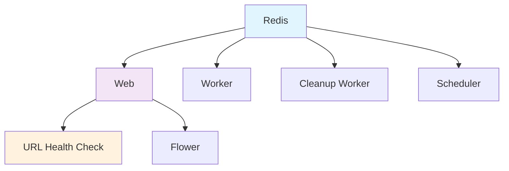

# Docker Deployment Guide for URL Processing

## Overview

This guide covers deploying the batch Excel processor with URL processing capabilities using Docker and Docker Compose. The system includes URL-based TNVED code matching with fallback to semantic search.

## Quick Start

### 1. Basic Deployment

```bash
# Clone the repository
git clone <repository-url>
cd batch-excel-processor

# Copy environment configuration
cp .env.example .env

# Start the services
docker-compose up -d

# Check service status
docker-compose ps
```

### 2. Development Deployment

```bash
# Start with development configuration
docker-compose -f docker-compose.yml -f docker-compose.dev.yml up -d

# View logs
docker-compose logs -f web worker
```

### 3. Production Deployment

```bash
# Set production environment variables
export URL_PROCESSING_ENABLED=true
export URL_PRIORITY=first
export URL_SECURITY_ENABLED=true

# Start production services
docker-compose --profile monitoring up -d

# Verify deployment
curl http://localhost:8000/health
```

## Environment Configuration

### Required Environment Variables

Create a `.env` file with the following URL processing variables:

```bash
# Core URL Processing
URL_PROCESSING_ENABLED=true
URL_PRIORITY=first
URL_TIMEOUT_SECONDS=5.0
URL_DATABASE_COLLECTION=url_tnved_mapping
URL_BATCH_SIZE=100

# URL Normalization
URL_NORMALIZATION_ENABLED=true
URL_REMOVE_QUERY_PARAMS=true
URL_REMOVE_FRAGMENTS=true
URL_NORMALIZE_PROTOCOL=true
URL_SUPPORTED_SHOPS=ozon,yandex_market,wildberries,aliexpress
URL_MAX_LENGTH=2048

# URL Security
URL_SECURITY_ENABLED=true
URL_VALIDATE_ON_INPUT=true
URL_SANITIZE_FOR_STORAGE=true
URL_MASK_SENSITIVE_PARAMS=true
URL_BLOCK_MALICIOUS_PATTERNS=true

# URL Database Management
URL_ENABLE_STATISTICS=true
URL_AUTO_CLEANUP_DUPLICATES=false
```

### Development vs Production Settings

**Development** (`.env.dev`):
```bash
URL_TIMEOUT_SECONDS=10.0
URL_DATABASE_COLLECTION=dev_url_tnved_mapping
URL_BATCH_SIZE=50
URL_BLOCK_MALICIOUS_PATTERNS=false
URL_AUTO_CLEANUP_DUPLICATES=true
```

**Production** (`.env.prod`):
```bash
URL_TIMEOUT_SECONDS=5.0
URL_DATABASE_COLLECTION=url_tnved_mapping
URL_BATCH_SIZE=200
URL_BLOCK_MALICIOUS_PATTERNS=true
URL_AUTO_CLEANUP_DUPLICATES=false
```

## Service Architecture

### Core Services

1. **Redis**: Task queue and caching
2. **Web**: Main web application with URL processing
3. **Worker**: Celery worker for processing tasks
4. **Cleanup Worker**: Celery worker for cleanup tasks
5. **Scheduler**: Celery beat for periodic tasks

### Monitoring Services (Optional)

6. **Flower**: Celery task monitoring
7. **URL Health Check**: URL database health monitoring

### Service Dependencies



## Volume Management

### Persistent Volumes

```yaml
volumes:
  redis_data:          # Redis persistence
  url_data:           # URL data storage
  chroma_db:          # ChromaDB data (mounted from host)
  temp_files:         # Temporary processing files (mounted from host)
  logs:               # Application logs (mounted from host)
```

### Volume Mounting Strategy

**Production**:
```yaml
volumes:
  - ./chroma_db:/app/chroma_db          # Database persistence
  - ./temp_files:/app/temp_files        # Processing files
  - ./logs:/app/logs                    # Log files
  - url_data:/app/url_data              # URL data storage
```

**Development**:
```yaml
volumes:
  - .:/app                              # Source code mounting
  - ./chroma_db:/app/chroma_db          # Database persistence
  - url_data_dev:/app/url_data          # Development URL data
```

## Health Checks

### Service Health Checks

Each service includes comprehensive health checks:

**Web Service**:
```yaml
healthcheck:
  test: ["CMD", "curl", "-f", "http://localhost:8000/health"]
  interval: 30s
  timeout: 10s
  retries: 3
  start_period: 40s
```

**Worker Service**:
```yaml
healthcheck:
  test: ["CMD", "celery", "-A", "batch_processor.workers.celery_app", "inspect", "ping"]
  interval: 30s
  timeout: 10s
  retries: 3
  start_period: 40s
```

**URL Database Health Check**:
```yaml
healthcheck:
  test: ["CMD", "python", "-c", "
    from services.url_database_manager import URLDatabaseManager;
    from services.chroma_manager import ChromaManager;
    chroma_manager = ChromaManager();
    url_db = URLDatabaseManager(chroma_manager.client);
    stats = url_db.get_statistics();
    print('URL DB OK' if stats.get('total_records', 0) >= 0 else 'URL DB ERROR')
    "]
  interval: 60s
  timeout: 30s
  retries: 3
  start_period: 60s
```

### Health Check Commands

```bash
# Check all services
docker-compose ps

# Check specific service health
docker-compose exec web curl -f http://localhost:8000/health

# Check URL database health
docker-compose exec web python -c "
from services.url_database_manager import URLDatabaseManager
from services.chroma_manager import ChromaManager
chroma_manager = ChromaManager()
url_db = URLDatabaseManager(chroma_manager.client)
print(url_db.get_statistics())
"

# Check worker status
docker-compose exec worker celery -A batch_processor.workers.celery_app inspect ping
```

## Deployment Scenarios

### Scenario 1: Full Production Deployment

```bash
# Set production environment
export COMPOSE_PROFILES=monitoring
export URL_PROCESSING_ENABLED=true
export URL_PRIORITY=first
export URL_SECURITY_ENABLED=true

# Deploy with monitoring
docker-compose up -d

# Load initial URL data
docker-compose exec web python url_database_manager_cli.py load-data \
  --file /app/url_data/initial_urls.xlsx \
  --source "production_initial"

# Verify deployment
curl http://localhost:8000/health
curl http://localhost:5555  # Flower monitoring
```

### Scenario 2: Development Deployment

```bash
# Start development environment
docker-compose -f docker-compose.yml -f docker-compose.dev.yml up -d

# Load test data
docker-compose exec web python url_database_manager_cli.py load-data \
  --file /app/url_data/test_urls.xlsx \
  --source "development_test"

# Enable hot reload and debugging
docker-compose logs -f web
```

### Scenario 3: URL-Only Processing

```bash
# Configure for URL-only mode
export URL_PROCESSING_ENABLED=true
export URL_PRIORITY=only

# Deploy with minimal resources
docker-compose up -d web worker redis

# Skip semantic search components
docker-compose stop cleanup_worker scheduler
```

### Scenario 4: High-Security Deployment

```bash
# Enable all security features
export URL_SECURITY_ENABLED=true
export URL_VALIDATE_ON_INPUT=true
export URL_SANITIZE_FOR_STORAGE=true
export URL_MASK_SENSITIVE_PARAMS=true
export URL_BLOCK_MALICIOUS_PATTERNS=true
export URL_MAX_LENGTH=1024

# Deploy with security monitoring
docker-compose --profile monitoring up -d

# Monitor security logs
docker-compose logs -f web | grep -i "security\|blocked\|malicious"
```

## Data Management

### Loading URL Data

```bash
# Load URL data into running container
docker-compose exec web python url_database_manager_cli.py load-data \
  --file /app/url_data/ozon_urls.xlsx \
  --source "ozon_2024"

# Batch load multiple files
docker-compose exec web bash -c "
for file in /app/url_data/*.xlsx; do
  python url_database_manager_cli.py load-data --file \$file --source batch_load_2024
done
"

# Load with validation
docker-compose exec web python url_database_manager_cli.py load-data \
  --file /app/url_data/urls.xlsx \
  --source "validated_2024" \
  --validate
```

### Database Backup and Restore

```bash
# Backup URL database
docker-compose exec web python url_database_manager_cli.py export \
  --output /app/url_data/backup_$(date +%Y%m%d).xlsx

# Copy backup to host
docker cp batch_processor_web:/app/url_data/backup_$(date +%Y%m%d).xlsx ./backups/

# Restore from backup
docker cp ./backups/backup_20240115.xlsx batch_processor_web:/app/url_data/
docker-compose exec web python url_database_manager_cli.py load-data \
  --file /app/url_data/backup_20240115.xlsx \
  --source "restore_20240115"
```

### Database Maintenance

```bash
# Get database statistics
docker-compose exec web python url_database_manager_cli.py stats

# Health check
docker-compose exec web python url_database_manager_cli.py health-check

# Cleanup duplicates
docker-compose exec web python url_database_manager_cli.py cleanup --remove-duplicates

# Validate data quality
docker-compose exec web python validate_url_data.py --database --report /app/logs/validation.txt
```

## Monitoring and Logging

### Log Management

```bash
# View all logs
docker-compose logs -f

# View specific service logs
docker-compose logs -f web
docker-compose logs -f worker

# View URL processing logs
docker-compose logs -f web | grep -i "url\|processing\|match"

# Export logs
docker-compose logs web > web_logs_$(date +%Y%m%d).log
```

### Performance Monitoring

```bash
# Monitor resource usage
docker stats

# Monitor URL processing performance
docker-compose exec web python -c "
from batch_processor.services.monitoring import get_url_processing_stats
stats = get_url_processing_stats()
print(f'URL Match Rate: {stats.url_match_rate:.2%}')
print(f'Average Lookup Time: {stats.average_url_lookup_time_ms:.2f}ms')
"

# Monitor database size
docker-compose exec web python url_database_manager_cli.py stats --format json | jq '.total_records'
```

### Flower Monitoring

Access Flower web interface at `http://localhost:5555`:

- Task monitoring and management
- Worker status and statistics
- Queue monitoring
- Task history and results

## Troubleshooting

### Common Issues

#### Issue 1: URL Processing Not Working

**Symptoms**:
```bash
docker-compose logs web | grep "URL search disabled"
```

**Diagnosis**:
```bash
# Check environment variables
docker-compose exec web env | grep URL_

# Check configuration
docker-compose exec web python -c "
from batch_processor.config.loader import load_config
config = load_config()
print(config.get('url_processing', {}))
"
```

**Solution**:
```bash
# Update environment variables
echo "URL_PROCESSING_ENABLED=true" >> .env
docker-compose restart web worker
```

#### Issue 2: URL Database Connection Issues

**Symptoms**:
```bash
docker-compose logs web | grep "ChromaDB.*error"
```

**Diagnosis**:
```bash
# Check ChromaDB volume
docker-compose exec web ls -la /app/chroma_db/

# Test database connection
docker-compose exec web python -c "
import chromadb
client = chromadb.PersistentClient(path='/app/chroma_db')
print(client.list_collections())
"
```

**Solution**:
```bash
# Fix permissions
docker-compose exec web chown -R appuser:appuser /app/chroma_db
docker-compose restart web worker
```

#### Issue 3: High Memory Usage

**Symptoms**:
```bash
docker stats | grep batch_processor
```

**Diagnosis**:
```bash
# Check batch sizes
docker-compose exec web env | grep BATCH_SIZE

# Monitor processing
docker-compose logs worker | grep "memory\|batch"
```

**Solution**:
```bash
# Reduce batch sizes
export URL_BATCH_SIZE=50
export PROCESSING_CHUNK_SIZE=500
docker-compose restart worker
```

### Debug Commands

```bash
# Enter container for debugging
docker-compose exec web bash

# Test URL normalization
docker-compose exec web python -c "
from services.url_normalizer import URLNormalizer
normalizer = URLNormalizer()
result = normalizer.normalize_url('https://www.ozon.ru/product/example-123456/?param=value')
print(result)
"

# Test URL database operations
docker-compose exec web python -c "
from services.url_database_manager import URLDatabaseManager
from services.chroma_manager import ChromaManager
chroma_manager = ChromaManager()
url_db = URLDatabaseManager(chroma_manager.client)
print(url_db.get_statistics())
"

# Check service connectivity
docker-compose exec web curl -f http://redis:6379
docker-compose exec worker celery -A batch_processor.workers.celery_app inspect ping
```

## Security Considerations

### Container Security

1. **Non-root user**: All containers run as non-root `appuser`
2. **Read-only filesystem**: Consider using read-only containers
3. **Resource limits**: Set memory and CPU limits
4. **Network isolation**: Use custom networks

### URL Security

1. **Input validation**: All URLs validated before processing
2. **Sanitization**: URLs sanitized before storage
3. **Parameter masking**: Sensitive parameters masked in logs
4. **Malicious pattern blocking**: Known malicious patterns blocked

### Data Security

1. **Volume encryption**: Consider encrypting persistent volumes
2. **Network encryption**: Use TLS for external connections
3. **Secret management**: Use Docker secrets for sensitive data
4. **Access control**: Implement proper authentication

## Performance Optimization

### Resource Allocation

```yaml
# docker-compose.override.yml
services:
  web:
    deploy:
      resources:
        limits:
          memory: 2G
          cpus: '1.0'
        reservations:
          memory: 1G
          cpus: '0.5'
  
  worker:
    deploy:
      resources:
        limits:
          memory: 4G
          cpus: '2.0'
        reservations:
          memory: 2G
          cpus: '1.0'
```

### Scaling Workers

```bash
# Scale workers for high load
docker-compose up -d --scale worker=3

# Scale cleanup workers
docker-compose up -d --scale cleanup_worker=2

# Monitor scaling
docker-compose ps
```

### Database Optimization

```bash
# Optimize ChromaDB
docker-compose exec web python -c "
from services.chroma_manager import ChromaManager
chroma_manager = ChromaManager()
# Implement database optimization
"

# Monitor database performance
docker-compose exec web python url_database_manager_cli.py health-check --performance
```

This comprehensive Docker deployment guide covers all aspects of deploying and managing the batch Excel processor with URL processing capabilities in containerized environments.